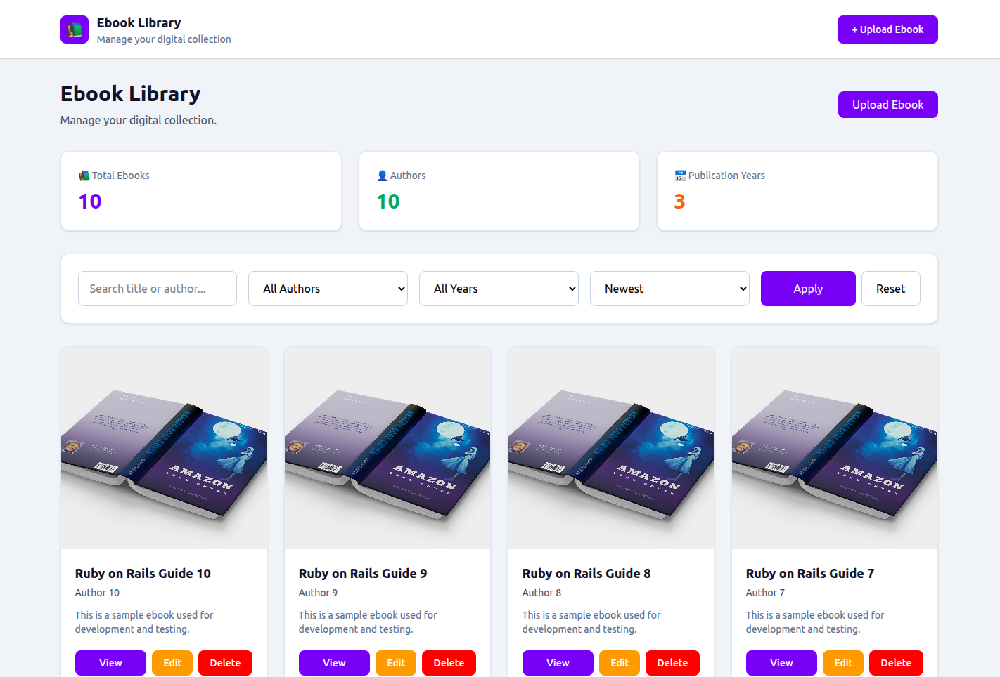
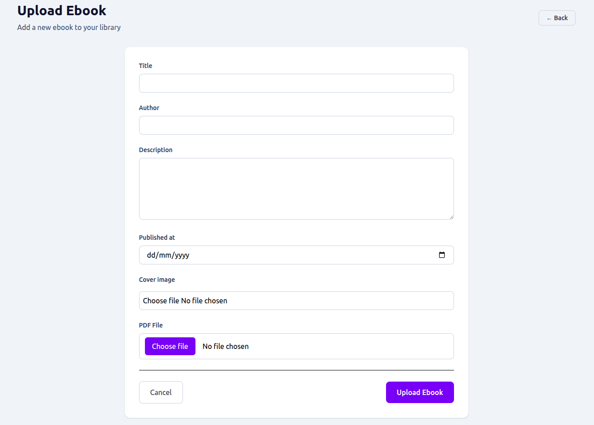
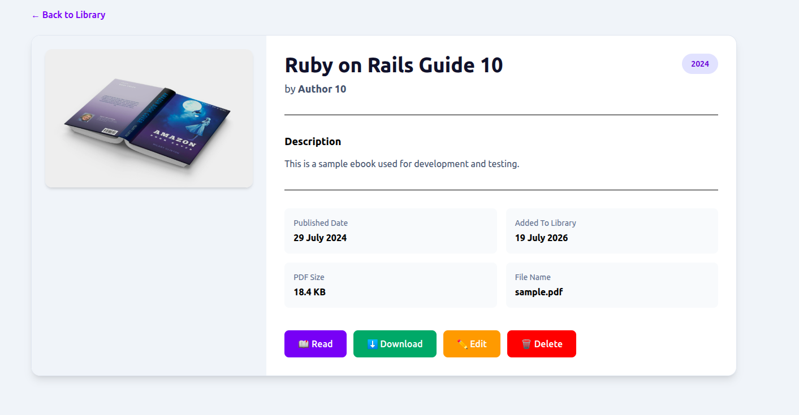
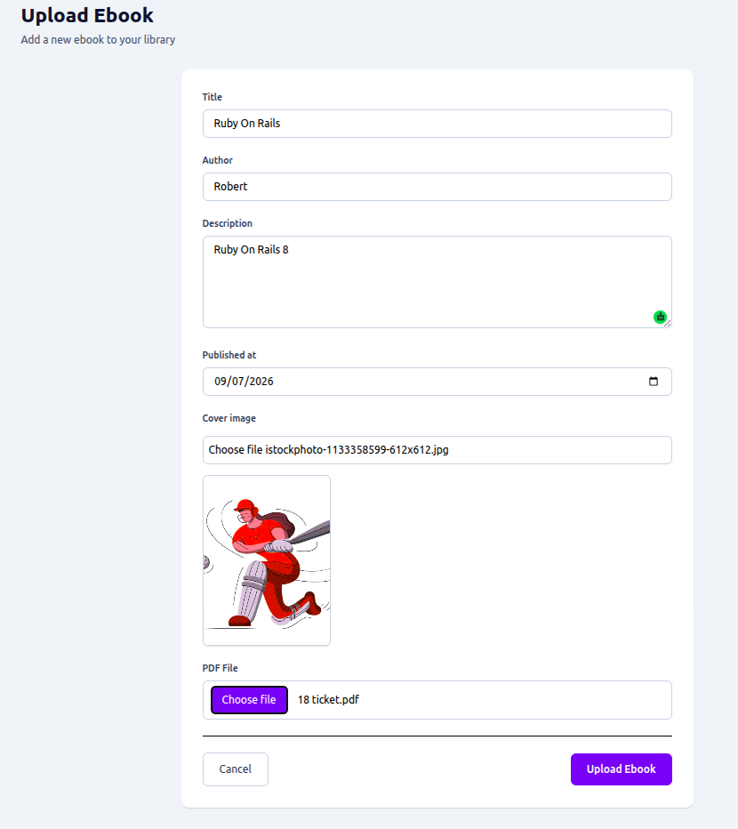
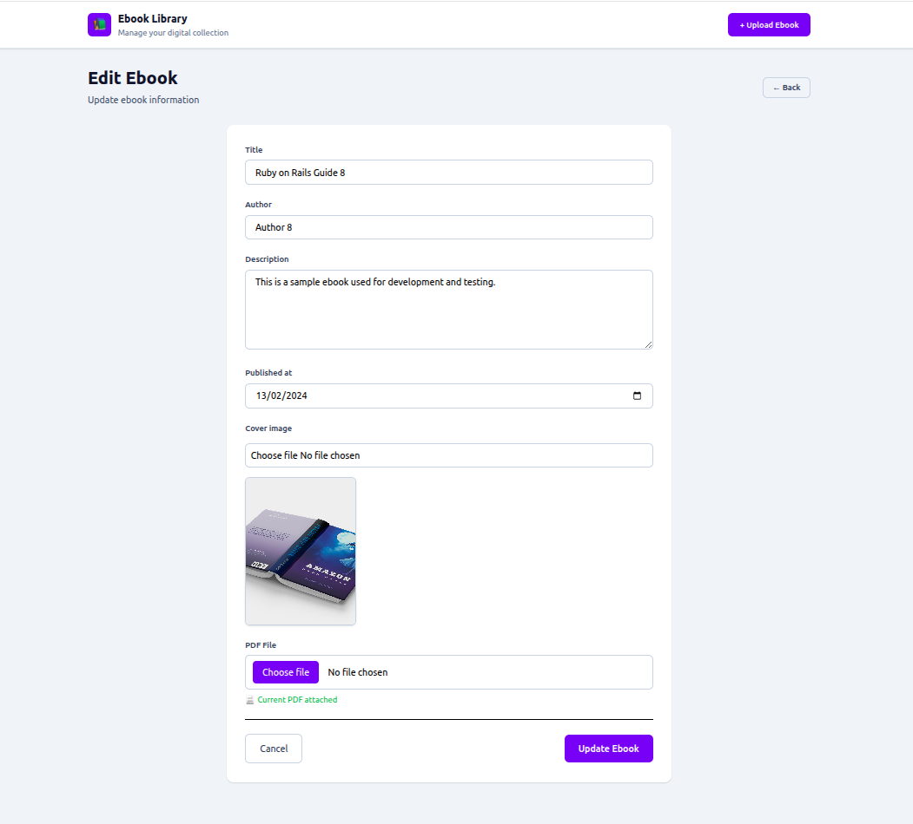
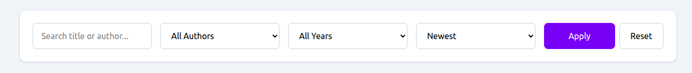

# 📚 Digital Ebook Library

A modern **Ruby on Rails 7** application for managing a digital ebook collection. Users can upload ebooks with cover images and PDF files, search and filter the library, read ebooks online, and download them through a clean and responsive interface.

---

## ✨ Features

- ✅ Ebook CRUD (Create, Read, Update, Delete)
- ✅ Upload Cover Images (Active Storage)
- ✅ Upload PDF Files
- ✅ Read PDF in Browser
- ✅ Download PDF
- ✅ Search by Title & Author
- ✅ Filter by Author
- ✅ Filter by Published Year
- ✅ Sort by Title & Created Date
- ✅ Pagination with Pagy
- ✅ Image Preview using StimulusJS
- ✅ Flash Messages
- ✅ Responsive UI with Tailwind CSS
- ✅ Model & Request Specs using RSpec

---

## 🛠 Tech Stack

- Ruby 3.2.2
- Ruby on Rails 7.1.6
- PostgreSQL
- Tailwind CSS
- Hotwire
- StimulusJS
- Active Storage
- Pagy
- RSpec
- FactoryBot
- Faker

---

## 🚀 Getting Started

### Clone Repository

```bash
git clone https://github.com/dheeraj288/digital-ebook-library.git
cd digital-ebook-library
```

### Install Dependencies

```bash
bundle install
```

### Setup Database

```bash
bin/rails db:create
bin/rails db:migrate
bin/rails db:seed
```

### Run Application

```bash
bin/dev
```

Visit:

```
http://localhost:3000
```

---

## 🧪 Run Tests

```bash
bundle exec rspec
```

---

## 📂 Project Structure

```
app/
├── controllers/
├── models/
├── views/
├── javascript/
├── helpers/

config/
db/
spec/
storage/
```

## 📸 Screenshots

### Home Page



---

### Upload Ebook



---

### Upload Ebook



---

### Ebook Details



---

### Edit Ebook



---

### Search & Filter



---

### Pagination


## 👨‍💻 Author

**Dheeraj**

Ruby on Rails Developer

GitHub:
https://github.com/dheeraj288